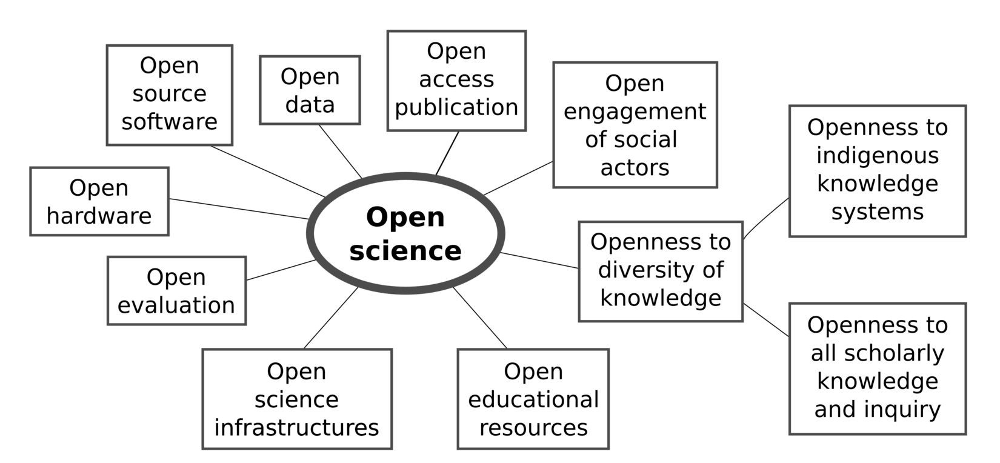
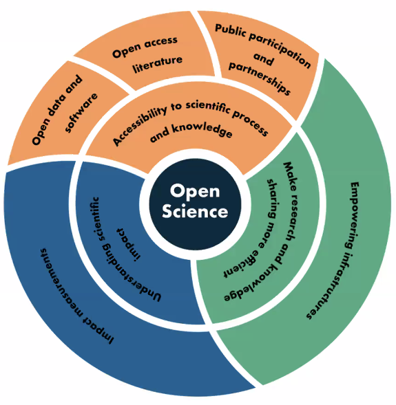
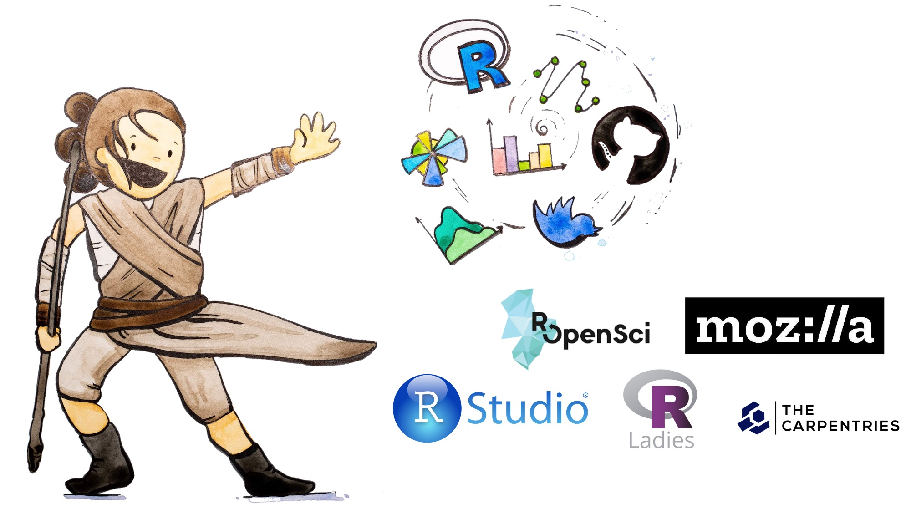
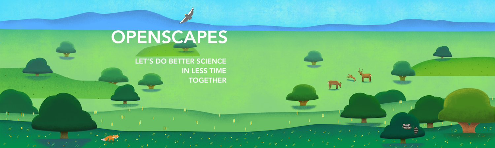
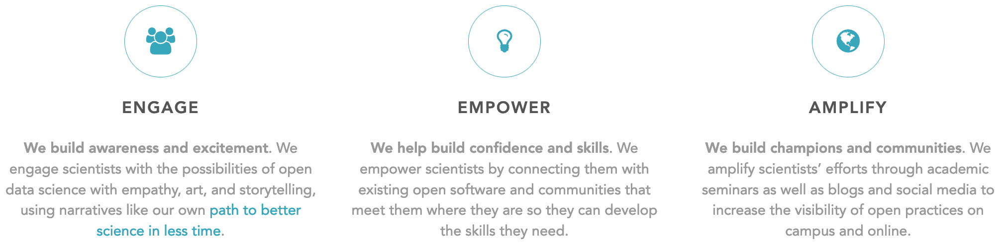

```{r setup, include=FALSE}
options(htmltools.dir.version = FALSE)
knitr::opts_chunk$set(
  fig.width=9, fig.height=3.5, fig.retina=3,
  out.width = "100%",
  cache = FALSE,
  echo = FALSE,
  message = FALSE, 
  warning = FALSE,
  fig.show = TRUE,
  hiline = TRUE
)

# Google slides: https://docs.google.com/document/d/1JbDzpiMi0n9iePYKLfwv69ljQKnFHwZ7/edit
```

```{r xaringan-themer, include=FALSE, warning=FALSE}
# install.packages("showtext")
library(xaringan)
library(xaringanthemer)
style_duo_accent(
  primary_color = "#1381B0",
  secondary_color = "#FF961C",
  inverse_header_color = "#FFFFFF"
)
```

<figure out how to delete this slide>

???

Hi everyone! I'm Julie Lowndes, and I'm founder and co-director of Openscapes. 

I'm excited to talk today about Open science as a movement and the art of Openscapes with my collaborator and friend Dr. Allison Horst!

Abstract: 
The open science movement is “a collaborative culture enabled by technology that empowers the open sharing of data, information and knowledge within the scientific community and the wider public to accelerate scientific research and understanding” ([Ramachandran et al 2021](https://agupubs.onlinelibrary.wiley.com/doi/epdf/10.1029/2020EA001562)). We’ve felt included in this movement through the #rstats community, and argue that open data science is a powerful entryway to welcome researchers to open science – one that transforms open science from an aspirational idea to a tangible daily benefit for efficiency, reproducibility, and collaboration. We will share how Openscapes is helping to onboard more research teams to the open science movement, in part through artwork to represent and develop ideas to make open science more inclusive and kind. 


---
exclude: TRUE
# Open science
```{r os, out.width = "85%", fig.align='center'}

## https://commons.wikimedia.org/wiki/File:Osc2021-unesco-open-science-no-gray.png
# https://en.wikipedia.org/wiki/Open_science
```

TODO cite

---

# Open science


###  "a collaborative culture enabled by technology that empowers the open sharing of data, information and knowledge within the scientific community and the wider public to accelerate scientific research and understanding" - [Ramachandran, Bugbee, and Murphy 2021](https://twitter.com/deepseadawn/status/1389262435022819330)

```{r ramachandran, out.width = "25%", fig.align='center'}

```


???
Open science has a lot of definitions. I like this one from Ramachandran et al: "a collaborative culture enabled by technology that empowers the open sharing of data, information and knowledge within the scientific community and the wider public to accelerate scientific research and understanding"

This is a really inspiring definition that I wholeheartedly buy into. This is how we can make science more efficient, transparent, and inclusive.

<!---
broader definitions of open science acknowledge that science is both a body of
54 knowledge and a systematic method for thinking. Broad definitions place an emphasis on
55 encouraging a culture of openness (Bartling & Friesike, 2014) that includes the entire process of
56 conducting science (National Academies of Sciences, Engineering, and Medicine, 2018) and
57 encourages open collaboration and access to knowledge (Vicente-Saez & Martinez-Fuentes,
58 2018). In its broadest definition, the term ‘open science’ refers to a paradigm shift in how the
59 methods of science are conducted. This expansive vision of open science acknowledges that
60 rapid technology changes, primarily driven by the Internet, may enable a second scientific
61 revolution that fundamentally changes research methods and standards across science.


I did not set out to be a champion for open science. I understood understood the Ideology (open knowledge is better for everything) but it seemed very far from my day-to-day as a marine ecologist, collecting data on boat etc. And I didn't know much about the technology and infrastructure that facilitate and enable open science, like open source products enable sharing, distribution, archiving. 

Disconnect between tools and ideology. And none of this seemed relevant to me as I struggled with my data analysis —

--->

---

```{r luke}
```
class: center, middle
background-image: url(img/horst-starwars-luke.jpg)
background-size: contain

.footnote[ TODO FIX
art: [@allison_horst](https://twitter.com/allison_horst)
]

???
Meanwhile, the day-to-day of research can be really lonely and demoralizing. We have all been in situations like Luke Skywalker here when we are staring at a problem that we can’t solve with the skillsets we have. As a marine ecologist without formal training in data skills, this has happened to me in big and small ways, from managing files like data_analysis_final_final_final.xls or feeling comfortable sharing my home-grown and messy code with colleagues.

---
```{r yoda}
```

class: center, middle
background-image: url(img/horst-starwars-yoda.jpg)
background-size: contain

.footnote[
art: [@allison_horst](https://twitter.com/allison_horst)
]

???

But open science is a complete game-changer here, for data-intensive research. I think of open science like the Force: more powerful than I ever imagined, and something that I could see and learn through examples and mentorship from others. And like the Force, open science has not only helped me solve challenges ahead of me, it's broadened my imagination of what is possible with the research questions I can ask and how I can contribute to science in modern ways like through teaching and sharing on the open web. 

---
```{r hands} 
```
class: center, middle
background-image: url(img/horst-starwars-hands.jpg)  
background-size: contain


.footnote[
art: [@allison_horst](https://twitter.com/allison_horst)
]


???

But open science is really not only about the skills and outcomes, it is about the people who participate and contribute to the community and grow the movement. These are people that are motivated by the same vision of inclusion and reproducibility and transparency and efficiency for science, and bring different experiences expertise and ideas so that together we can learn more and do more and be better. 

---
exclude: TRUE
```{r rey-toc-full}
```
class: title-slide, right, bottom
background-image: url(img/horst-starwars-rey.png)
background-size: contain
background-position: bottom left   


What this all means is that I am gained confidence and leadership ...

---
```{r rey-communities, out.width = "100%", fig.align='center'}

```


???

For me, what made me feel powerful and like part of the open science movement was the #rstats community. 
R was my entryway to open science. The R communityintroduced me to concepts of data science and the benefit of open and inclusive practices, which I think of as open data science. 

---

# Open science as a movement

(Screenshots: Nature paper, kinder science, R for Excel)

## Kinder, more collaborative and inclusive science


???

And since then, I have increasingly empowered by open science and driven to welcome more researchers to be a part of the open science movement

I led publications describing my team's path to better science in less time through open data science, and how open software enables kinder science. 

I've also learned how to teach through the Carpentries and developed trainings to help others work in the way we do. 

All of this together makes open science a movement: a movement for kinder, more collaborative and inclusive science. 

I started to think about how to help operationalize the lessons my team had learned and help other teams acheive this as well, while growing the movement. 

This led me to found Openscapes through a fellowship with Mozilla

---
```{r openscapes-grassland, out.width = '100%', fig.align='center'}

```

```{r enage-empower-amplify, out.width = "100%", fig.align='center'}

```

(mozilla)

???

Openscapes helps research groups reimagine data analysis, develop modern skills that are of immediate value to them, and cultivate collaborative and inclusive research teams.

I wanted to create an approach that could scale my experience so that more researchers could feel as empowered by the force of open data science as I have. I thought that a place where Openscapes could help could be in engaging researchers to build awareness and excitement, empowering them to build confidence and skills, and amplifying them to build champions and communities

How can we do something more radical, outside of the traditional science lanes, that helps inspire and welcome researchers to help seed culture change?

Different ways of contributing and getting credit in science, make it less lonely?


---

class: left, top
background-image: url(img/rstats_twitter.png)  
background-size: contain

## Openscapes invests in welcome.

???

Investing in artwork is just one of **many** ways that Openscapes is a leader in creating welcoming entryways into open science. 

Hi everyone, I'm Allison - and as a past Openscapes mentee *and* artist for Openscapes, I'm excited to share a bit more about my experience as an Openscapes artist and an Openscapes Champion. 

---

[Example here: illustration + twitter response?]

???

Artwork is powerful because it helps scientists tell a story that connects with people. For example, you might have reacted to Julie's Star Wars analogy and illustrations. Just like artwork can share a feeling, it can also help people feel like a new concept, topic, or even field is open to them. This is something Julie realized early on in Openscapes development - from Star Wars to open landscapes and beyond, art has always been a core part of the Openscapes strategy to welcome more people into the landscape of open data science.

---
```{r tidydata}

```

class: center, middle
background-image: url(img/tidydata-collab.jpg)  
background-size: contain

???

Whether it's art to introduce specific concepts, for example how tidy data facilitates collaboration by allowing team members to work with similar tools...

---
```{r workflow}

```

class: center, middle
background-image: url(img/data_workflow.jpeg)  
background-size: contain

???

...or art to describe data workflows...

---

class: center, middle
background-image: url(img/horst_code_hero.jpeg)  
background-size: contain

???

...or art to highlight the importance of supportive communities...


---
```{r eco-r4ds}

```

class: center, middle
background-image: url(img/eco-r4ds.png)  
background-size: contain

???

...or even art to envision entire fields, like this one, updated from the classic R4DS illustration for Environmental Data Science where Julie, Erin and I work - at all scales, art can help welcome more people to the landscape of open data science. 

---

class: center, middle
background-image: url(img/horst_air.png)  
background-size: contain

???

And while the focus of my artwork with Openscapes has been to help welcome *others* into their program, working with Julie as an Openscapes artist also created a welcoming entry for me...

I started drawing illustrations for my own statistics and data analysis courses back around 2013 and had created some one-off pieces for publications, but working with Julie to illustrate Openscapes back in 2018 was the first time I felt my artwork was professionally valued as part of an organization's overall vision. It also kicked off a series of collaborations, including as Artist-in-Residence with the National Center for Ecological Analysis and Synthesis and RStudio - opportunities that I wouldn't have had without Julie's advocacy...and friendly prodding to get on twitter. In short, creating artwork for Openscapes opened up a whole new professional art landscape for me.

But I haven't just been empowered by Openscapes' investment in welcoming artwork - I've also reimagined my "actual job" (teaching environmental data science) based on what I learned through mentorship in the Openscapes Champions program. Julie, do you mind telling us a bit more about the Champions program? (so cheesy but this might work if we're going full cheese on the Brady Bunch style co-presenting)...

---
```{r champions-pathways, out.width = "85%", fig.align='center'}
knitr::include_graphics("img/horst-champions-pathways.jpg")
```

???
Why yes Allison, I would love to share about the Champions program.

The Champions program supports scientific research groups as they shift to open science and collaborate more efficiently around data analysis and stewardship. This shift can be lonely and demoralizing like the sad animals in the lower left here, but through the Openscapes Champions program, science teams are engaged, empowered and amplified on their paths toward open science!   
---
## Openscapes Champions Program
### Remote-by-design, cohort-based mentorship for research teams

Welcomes and onboards research teams to open data science:

- reimagine data analysis
- develop modern skills that are of immediate value to them
- cultivate collaborative and inclusive research teams.

Professional development and leadership skills for research teams. Helping them see themselves as a team and work more openly within their team and across teams in the cohort.

Focus on building resilient research groups and reducing burden from team leads, especically for early career faculty in a changing softwarescape

???

The delivery mechanism of this training is really powerful. Openscapes Champions remotely convenes a cohort of science teams twice per month over two or four months for 1.5-hour video calls that we call Cohort Calls. This is a different kind of workshop structure (modeled after Mozilla Open Leaders and remote-by-design) where small time requirements over longer time frames fosters incremental change, accountability, and community building within the realities of scientists’ busy schedules, varying expertise and needs. 

Each Cohort Call uses the Champions Lesson Series, which is an open curriculum originally based on what was instrumental in the Ocean Health Index (OHI) team’s path to better science in less time, and openly iterated as we learn. We start off each call with a reminder of our Code of Conduct and provide multiple channels for participation, including through silent contributions to the Google Doc Agenda, breakout groups, and full-group discussions.

Focus on building resilient research groups and reducing burden from team leads, especically for early career faculty in a changing softwarescape

---
(Zoom faces & logos woot)

???

So far: academia, NOAA x2, NASA, CSU, CSS, Env Canada 
Visuals Zoom faces and Logos of all of these. Each individ campuses, Cornell etc

helping groups see themselves as a team. work more openly within the team, within the cohort, and beyond.
similiarities of data issues, not differences in specific research topic

---
exclude: TRUE
```{r zoom-agenda, out.width = "100%"}
knitr::include_graphics("img/nwfsc-zoom-gdoc.jpg")
```


???

And this is what it looks like

---

Examples of what we talk about 
TODO chat w/ Allison how to visualize this slide? Text, screenshots?

- R Markdown
- Onboarding docs & Codes of Conduct
- Anti-racism & inclusion
- Pathways. 
- Establish seaside chats. 

show repos
TODO cite Cabunoc Mayes et al.

???

Participants attend as teams, and come prepared for engaged participation as a whole cohort and within smaller breakout groups (as teams and mixed across teams). Discussions focus around collaborative mindsets, norms, and software to enable open, reproducible, inclusive research, with a balance of tools like R (including tidyverse, RMarkdown), GitHub (Issues), Google Drive, and Twitter and practices like examples from the OHI and previous Champions, inclusive design, psychological safely, and facilitation techniques. Teams intentionally have a mix of data/coding experience and responsibilities; there are no coding prerequisites to participate. 

These are some of their products, but even more important are their stories.

---

## 3 major ways Openscapes changed how I do & teach environmental data science: 

--

### 1. Overhauled tools & skills to modernize my course for collaborative & team data science

--

### 2. Implemented strategies to work more efficiently as a teacher and colleague

--

### 3. Got braver as an open educational resources (OER) contributor

---

class: left, middle

## "The internship is a good one, and has made me so appreciative of all the skills you equipped us with. We were actually able to tag team an introduction to GitHub for our supervisor which was a super empowering experience."

???

As an example of reach: I teach ~100 students in an introductory data science course at UCSB each year, and all of them are benefitting from what I learned and continue learning from Openscapes - and the ripple effect is very real! 

Here's an email I received from two recent graduates, sharing how they had been able to lead a git and GitHub workshop in their new job -- which is a direct outcome of Openscapes' encouragement to include modern tools for collaboration in my courses.

I am a happier and more impactful teacher because of Openscapes.

---

- Scaling out impact? 

- Value in confidence building 

- A community at UCSB

- End on growth & ripple effect here, leading into Julie's section on learning & iterating

---

# We're learning & iterating openly as we go

- sharing as we go. publications, blogs, talks. all materials are open source to reuse. 

- Community engagement, partnerships to meet specific community needs

- expanding the team and partners

---
Really, trying to amplify. More and more stories and examples of folks championing open science, and having it become part of their jobs. Need more of this. 

This work is valuable. We need it to be valued within our current systems. 

- artwork and DEI in our grants. 

???

Artwork is now a line-item in our grants. We want to support creative efforts
DEI expertise in our grants. We’re investing in many things that are important to support/prioritize: Paying for expertise we value in addition to trying to learn on our own

Working with an artist isn't just to represent concepts you already have, but it's a strategy for innovation and new ideas. 

---

Getting comfortable sharing imperfect work, being bolder.  iterating, learning 

- Putting kinder science up from (not hidden behind DS)
- Learning w/ Tara & Dawn
- cite: blog posts with Dawn Wright and Tara Robertson

???
Being comfortable sharing imperfect work has been a big part of working with Allison.......

---

# Learning & iterating represented in artwork (Allison - 2 min)

- Doodles > Sketches > Drafts > Final
- How this captures changes in Openscapes? 
- tidydata series?

---

# Closing - Julie (2 min)

- Have pathways illustration as the background, sans rangers
- 

???

Join us!


---
# Thank you!

---

# Cutting room floor

---

---
```{r whalesharks_tweet}
```

.pull-left[
```{r whaleshark, out.width = "100%"}
# knitr::include_graphics("img/whale_shark.png")
```
]

.pull-right[
```{r krill, out.width = "100%"}
# knitr::include_graphics("img/krill.png")
```
]

???

---
