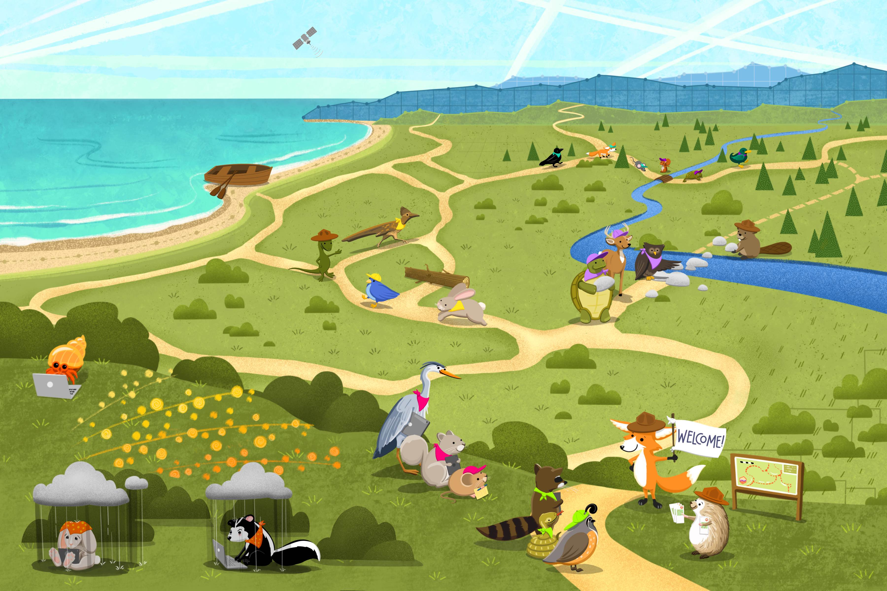
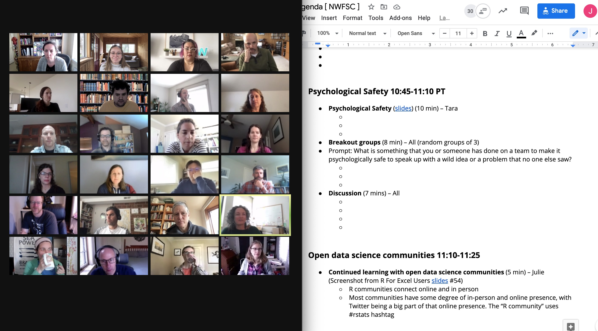
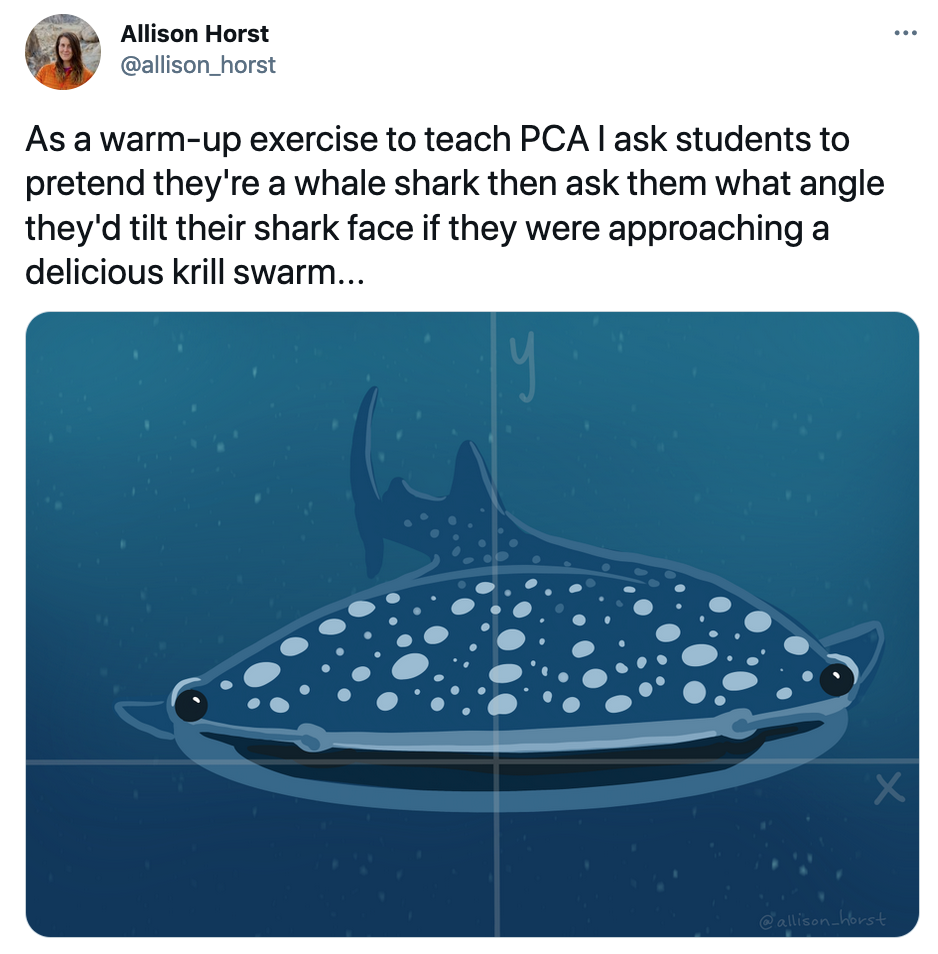
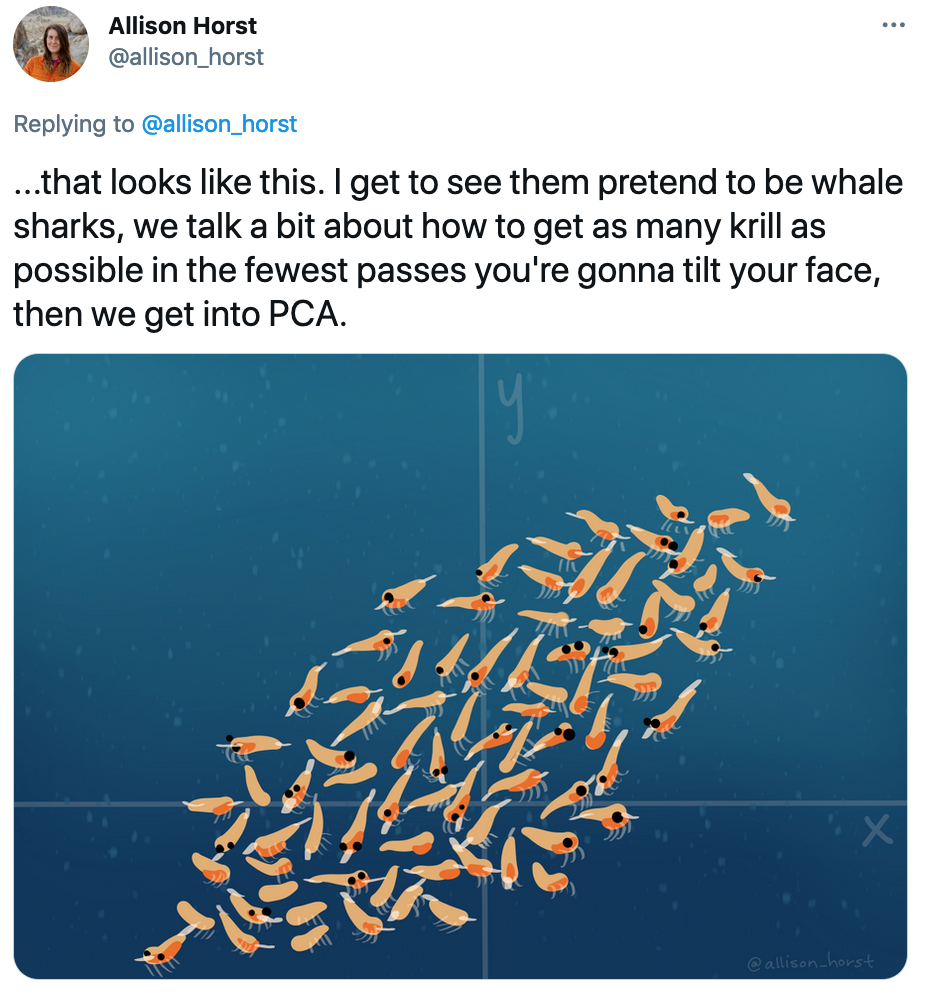

```{r setup, include=FALSE}
options(htmltools.dir.version = FALSE)
knitr::opts_chunk$set(
  fig.width=9, fig.height=3.5, fig.retina=3,
  out.width = "100%",
  cache = FALSE,
  echo = FALSE,
  message = FALSE, 
  warning = FALSE,
  fig.show = TRUE,
  hiline = TRUE
)

# Google slides: https://docs.google.com/document/d/1JbDzpiMi0n9iePYKLfwv69ljQKnFHwZ7/edit
```

```{r xaringan-themer, include=FALSE, warning=FALSE}
# install.packages("showtext")
library(xaringan)
library(xaringanthemer)
style_duo_accent(
  primary_color = "#1381B0",
  secondary_color = "#FF961C",
  inverse_header_color = "#FFFFFF"
)
```

<figure out how to delete this slide>

???

Hi everyone! I'm Julie Lowndes, and I'm founder and co-director of Openscapes. 

I'm excited to talk today about Open science as a movement and the art of Openscapes with my collaborator and friend Dr. Allison Horst!

---
# Open science

some way to illustrate tools/infrastructure separated from ideology

<!---
### Open science is transparency at all stages of the research process, coupled with free and open access to data, code, and papers

source: [*Hampton et al. 2015* The Tao of open science for ecology](https://esajournals.onlinelibrary.wiley.com/doi/full/10.1890/ES14-00402.1)

--->

???

I did not set out to be a champion for open science. I understood understood the Ideology (open knowledge is better for everything) but it seemed very far from my day-to-day as a marine ecologist, collecting data on boat etc. And I didn't know much about the technology and infrastructure that facilitate and enable open science, like open source products enable sharing, distribution, archiving. 

Disconnect between tools and ideology. And none of this seemed relevant to me as I struggled with my data analysis —

---

```{r luke}
```
class: center, middle
background-image: url(img/horst-starwars-luke.jpg)
background-size: contain

.footnote[ TODO FIX
art: [@allison_horst](https://twitter.com/allison_horst)
]

???
(rapid walk-through)
I was lonely and demoralized when it came to data analysis. I kept having situations where I couldn't solve the problem in front of me with the skillsets I had, whether this was learning to code in a total panic by myself or collaborating with others through forwarded emails with attachments like data_analys_final_final_final.xls

---
```{r yoda}
```

class: center, middle
background-image: url(img/horst-starwars-yoda.jpg)
background-size: contain

.footnote[
art: [@allison_horst](https://twitter.com/allison_horst)
]


???

But open science open data science changed all that for me: it was more powerful than I ever imagined, and has not only helped me solve challenges ahead of me, it's broadened my imagination of what is possible with the research questions I can ask and how I can contribute to science through communication and publishing on the open web. 

---
```{r hands} 
```
class: center, middle
background-image: url(img/horst-starwars-hands.jpg)  
background-size: contain


.footnote[
art: [@allison_horst](https://twitter.com/allison_horst)
]


???

And really that is because of the open data science community. These are the folks creating open and inclusive tools for data science.  The idea that we are motivated by the same vision of inclusion and reproducibility and transparency and efficiency, and we all come at it with different motivations and experiences and bring different expertise and ideas so that together we can learn more and do more and be better. 

---
exclude: TRUE
```{r rey-toc-full}
```
class: title-slide, right, bottom
background-image: url(img/horst-starwars-rey.png)
background-size: contain
background-position: bottom left   


What this all means is that I am gained confidence and leadership ...

---
# Open data science

illustration of the tools/ideology with communities and people logos?
This sounds like the r4ds illustration. or the hands. 

ROpenSci, RLadies, RStudio, Carpentries, Mozilla logos / pics of unconfs 

Nature paper

???

[rework this lang]

For me, the #rstats community was this entryway to open science. Open data science. This made me feel included and part of something that helped me do my science better in less time.

This helped us reimagine our data analysis with the Ocean Health Index. helped us articulate reproduciblity woes and solutions, and collab and comms


<!--- 
rOpenSci welcomed me to this community as a quite timid new coder and introduced me to seasoned developers who valued my questions and contributions. RStudio leadership has been a huge part of my path as well....

Through the Carpentries I learned how to teach with empathy for my learners, and we started a Mozilla study group called Eco-Data-Science in 2016 and and RLadies chapter in 2018. RLadies has been so transformational in my life and has helped me become the feminist I want to be: which is about supporting women and gender minorities, and thinking about data feminism as a way to examine and challenge power (cite)

--->

---

# Open science as a movement

## Kinder, inclusive, collaborative science

<!---
"Good communities don't make themselves. We've got a lot to be grateful for, and we all have to do our part to keep it going" — Robin Wall Kimmerer's Dad, *Braiding Sweetgrass*

--->

???

All of this together makes open science a movement: a movement towards kinder, inclusive, and  collaborative science.  

Taking inspiration from the Get Out The Vote movements and All We Can Save

---
# Openscapes: Let's do better science in less time, together

???

This is really the thinking of Openscapes: how do we welcome other researchers to the open science movement? How can we learn from my experience and scale it? 

How can we do something more radical, outside of the traditional science lanes, that helps inspire and welcome researchers to help seed culture change?

Different ways of contributing and getting credit in science, make it less lonely?

---

# Openscapes: investing in welcome

???

Investing in artwork is just one of **many** ways that Openscapes is a leader in creating welcoming entryways into open science. 

Hi everyone, I'm Allison - and as a past Openscapes mentee *and* artist for Openscapes, I'm really honored that Julie asked me to join her for this talk to share a bit more about my experience as an Openscapes artist and Champion. 

---

[Example here: illustration + twitter response?]

???

Artwork is powerful because it help scientists tell a story that connects with people. For example, you might have reacted to Julie's Star Wars analogy and illustrations. Artwork can also help people feel like a new concept, topic, or even field is open to them. This is something Julie realized early on in Openscapes development - from Star Wars to open landscapes and beyond, art has always been a core part of the Openscapes strategy to welcome more people into the landscape of open data science.

---

[some openscapes artwork?]

???

And while the focus of my artwork with Openscapes has been to help welcome *others* into their program, working with Julie as an Openscapes artist also created a welcoming entry for me...

I started drawing illustrations for my own statistics and data analysis courses back around 2013 and had created some one-off pieces for publications, but working with Julie to illustrate Openscapes back in 2018 was the first time I felt my artwork was professionally valued as part of an organization's overall vision. It also kicked off a series of collaborations, including as Artist-in-Residence with the National Center for Ecological Analysis and Synthesis and RStudio - opportunities that I wouldn't have had without Julie's advocacy...and friendly prodding to get on twitter.

But I haven't just been empowered by Openscapes' investment in welcoming artwork - I've also reimagined my "actual job" (teaching environmental data science) based on what I learned through mentorship in the Openscapes Champions program. Julie, do you mind telling us a bit more about the Champions program? (so cheesy but this might work if we're going full cheese on the Brady Bunch style co-presenting)...

---
```{r champions-pathways, out.width = "85%", fig.align='center'}

```

???
Why yes Allison, I would love to share about the Champions program.

The Champions program supports scientific research groups as they shift to open science and collaborate more efficiently around data analysis and stewardship. This shift can be lonely and demoralizing like the sad animals in the lower left here, but through the Openscapes Champions program, science teams are engaged, empowered and amplified on their paths toward open science!   
---
## Openscapes Champions Program
### Remote-by-design, cohort-based mentorship for research teams

**Professional development and leadership skills for research teams:** 

- **engage and onboard** to the open data science landscape
- **empower** as champions and leaders
- **amplify and welcome** as part of the growing open community

Focus on building resilient research groups and reducing burden from team leads, especically for early career faculty in a changing softwarescape

???

The delivery mechanism of this training is really powerful. Openscapes Champions remotely convenes a cohort of science teams twice per month over two or four months for 1.5-hour video calls that we call Cohort Calls. This is a different kind of workshop structure (modeled after Mozilla Open Leaders and remote-by-design) where small time requirements over longer time frames fosters incremental change, accountability, and community building within the realities of scientists’ busy schedules, varying expertise and needs. 

Each Cohort Call uses the Champions Lesson Series, which is an open curriculum originally based on what was instrumental in the Ocean Health Index (OHI) team’s path to better science in less time, and openly iterated as we learn. We start off each call with a reminder of our Code of Conduct and provide multiple channels for participation, including through silent contributions to the Google Doc Agenda, breakout groups, and full-group discussions.

Focus on building resilient research groups and reducing burden from team leads, especically for early career faculty in a changing softwarescape

---
(Zoom faces & logos woot)

???

So far: academia, NOAA x2, NASA, CSU, CSS, Env Canada 
Visuals Zoom faces and Logos of all of these. Each individ campuses, Cornell etc

helping groups see themselves as a team. work more openly within the team, within the cohort, and beyond.
similiarities of data issues, not differences in specific research topic

---
```{r zoom-agenda, out.width = "100%"}

```


???

And this is what it looks like

---

Examples of what we talk about 
TODO chat w/ Allison how to visualize this slide? Text, screenshots?

- R Markdown
- Onboarding docs & Codes of Conduct
- Anti-racism & inclusion
- Pathways. 
- Establish seaside chats. 
- link to Cabunoc Mayes et al.

???

Participants attend as teams, and come prepared for engaged participation as a whole cohort and within smaller breakout groups (as teams and mixed across teams). Discussions focus around collaborative mindsets, norms, and software to enable open, reproducible, inclusive research, with a balance of tools like R (including tidyverse, RMarkdown), GitHub (Issues), Google Drive, and Twitter and practices like examples from the OHI and previous Champions, inclusive design, psychological safely, and facilitation techniques. Teams intentionally have a mix of data/coding experience and responsibilities; there are no coding prerequisites to participate. 

---

## Allison Openscapes experience 

### 3 minutes (3 slides?)

???

So *how* has participating in the Champions program changed how I work and teach in environmental data science? Through Openscapes I: 

1. Overhauled tools & skills to modernize my course for collaborative & team data science, and now teach those in courses - the impact and reach is broad.

1. Implemented strategies to work more efficiently as a teacher and colleague - I'm especially a better colleague to my future self. 

1. Got braver! I started sharing my materials more openly, even if they weren't finished -- and now am happily contributing to open educational resources more fearlessly. 

---

[image: email from students]

??? 

- As an example of reach: I teach ~100 students in an introductory data science course at UCSB each year, and all of them are benefitting from what I learned and continue learning from Openscapes - and the ripple effect is real! 

Here's an email I received from a recent graduate, telling how they had been able to lead a git and GitHub workshop in their new job -- which is a direct outcome of Openscapes' encouragement to include modern tools for collaboration in my courses.

This makes me a happier & more impactful teacher, and empowers students to be leaders & teachers. 

---

- Scaling out impact? 

- Value in confidence building 

- A community at UCSB

- End on growth & ripple effect here, leading into Julie's section on learning & iterating

---

# We're learning & iterating openly as we go

- sharing as we go. publications, blogs, talks. all materials are open source to reuse. 

- Community engagement, partnerships to meet specific community needs

- expanding the team and partners

---
Really, trying to amplify. More and more stories and examples of folks championing open science, and having it become part of their jobs. Need more of this. 

This work is valuable. We need it to be valued within our current systems. 

- artwork and DEI in our grants. 

???

Artwork is now a line-item in our grants. We want to support creative efforts
DEI expertise in our grants. We’re investing in many things that are important to support/prioritize: Paying for expertise we value in addition to trying to learn on our own

Working with an artist isn't just to represent concepts you already have, but it's a strategy for innovation and new ideas. 

---

Getting comfortable sharing imperfect work, being bolder.  iterating, learning 

- Putting kinder science up from (not hidden behind DS)
- Learning w/ Tara & Dawn
- cite: blog posts with Dawn Wright and Tara Robertson

???
Being comfortable sharing imperfect work has been a big part of working with Allison.......

---

# Learning & iterating represented in artwork (Allison - 2 min)

- Doodles > Sketches > Drafts > Final
- How this captures changes in Openscapes? 
- tidydata series?

---

# Closing - Julie (2 min)

- Have pathways illustration as the background, sans rangers
- 

???

Join us!


---
# Thank you!

---

# Cutting room floor

---

---
```{r whalesharks_tweet}
```

.pull-left[
```{r whaleshark, out.width = "100%"}

```
]

.pull-right[
```{r krill, out.width = "100%"}

```
]

???

---
